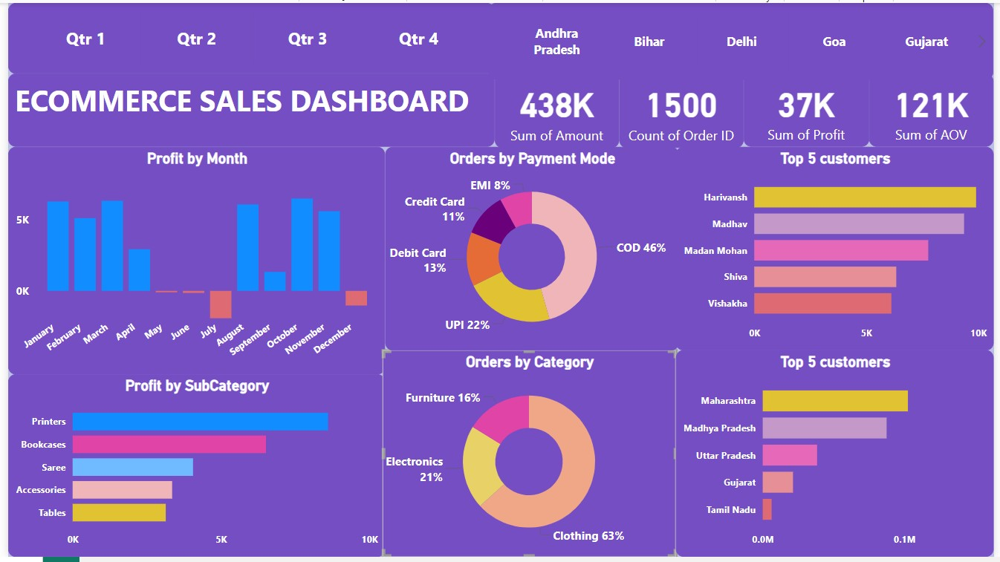

# Ecommerce Sales Dashboard (Power BI)

This project showcases an interactive Power BI dashboard built for an ecommerce website to gain insights into annual sales, customer behavior, product performance, and regional trends. The dashboard was created after thorough data cleaning and structuring in Excel.

---

## Objective

To uncover key sales trends, purchasing patterns, and customer segments to help stakeholders make data-driven decisions for improving marketing and operations.

---

##  Dataset Overview

- **Source Files**: `Orders.csv`, `Details.csv`
- **Total Records**: 9,000+ transaction rows  
- **Data Points**: Order ID, Category, Subcategory, Payment Method, Profit, State, Customer Name, Quantity, etc.

---

## Key Insights

- **Top Performing Category**: Clothing — 63% of all orders  
- **Primary Payment Method**: Cash on Delivery — 46% of transactions  
- **Peak Sales Month**: October — 20% of annual profit  
- **High-Profit Subcategories**: Printers, Bookcases, Sarees

---

##  Tools & Features

- **Power BI**: For dashboard creation and data visualization  
- **Excel**: For data cleaning and transformation  
- **Visualizations Used**:  
  - Bar Chart, Pie Chart, Donut Chart  
  - Clustered Bar, Line, Area, and Scatter Charts  
  - Slicers, Maps, Cards for KPIs  
  - Drill-downs and filters for user-driven analysis

---

## Preview

---

##  Dashboard Capabilities

- Dynamic filters for state-wise and customer-wise exploration  
- Real-time visual updates on profit by category and subcategory  
- Interactive analysis of payment modes and sales channels  
- Segmentation based on customer names, locations, and purchase behavior

